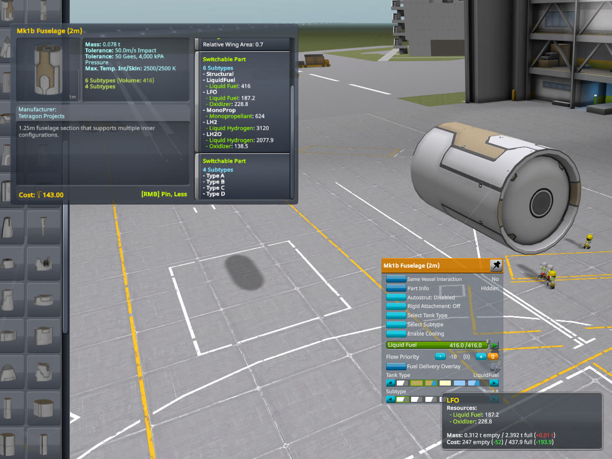

# B9 Part Switch /L Unofficial

B9 Part Switch is a plugin that allows mods to make parts switchable, similar to Firespitter and Interstellar fuel switchers.  This mod doesn't do anything by itself, but provides a way for other mods to enable switching. 

Unofficial fork by Lisias.

## In a Hurry

* [Latest Release](https://github.com/net-lisias-kspu/B9PartSwitch/releases)
	+ [Binaries](https://github.com/net-lisias-kspu/B9PartSwitch/tree/Archive)
* [Source](https://github.com/net-lisias-kspu/B9PartSwitch)
* Documentation
	+ [Project's README](https://github.com/net-lisias-kspu/B9PartSwitch/blob/master/README.md)
	+ [Install Instructions](https://github.com/net-lisias-kspu/B9PartSwitch/blob/master/INSTALL.md)
	+ [Change Log](./CHANGE_LOG.md)
	+ [TODO](./TODO.md) list

## Description

### Features

* Parts can switch their resources, models, stack nodes, textures, heat tolerance, surface attach position, crash tolerance, and many other fields
* Mass and cost can be modified
* Tanks used to switch resources are defined centrally to allow easy modification and minimal setup
* Easy to read, easy to write configs
* Configs are designed for easy patching by ModuleManager
* Unlimited switchers can be defined on the same part, provided that they do not conflict

## Installation

Detailed installation instructions are now on its own file (see the [In a Hurry](#in-a-hurry) section) and on the distribution file.

## License:

LGPL 3.0.

Please note the copyrights and trademarks in [NOTICE](./NOTICE).

## UPSTREAM

* [bac9](https://forum.kerbalspaceprogram.com/index.php?/profile/57757-bac9/) ROOT
	+ Forum (M.i.A)
	+ [Bitbucket](https://bitbucket.org/bac9/ksp_plugins/)
* [blowfish](https://forum.kerbalspaceprogram.com/index.php?/profile/119688-blowfish/) CURRENT
	+ [Forum](https://forum.kerbalspaceprogram.com/index.php?/topic/140541-*) 
	+ [Github](https://github.com/blowfishpro/B9PartSwitch/wiki)
